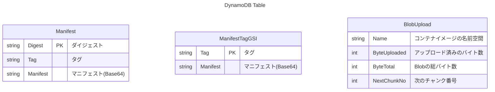

```mermaid
---
title: DynamoDB Table
---
erDiagram
    Manifest {
        string Digest PK "ダイジェスト"
        string Tag "タグ"
        string Manifest "マニフェスト(Base64)"
    }

    ManifestTagGSI {
        string Tag PK "タグ"
        string Manifest "マニフェスト(Base64)"
    }


    BlobUpload {
        string Name "コンテナイメージの名前空間"
        int ByteUploaded "アップロード済みのバイト数"
        int ByteTotal "Blobの総バイト数"
        int NextChunkNo "次のチャンク番号"
    }
```