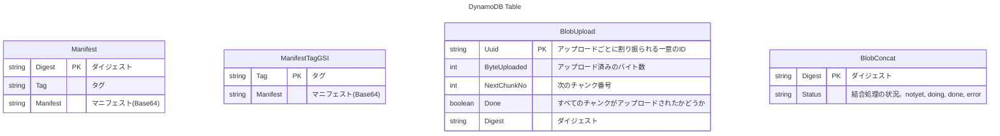

```mermaid
---
title: DynamoDB Table
---
erDiagram
    Manifest {
        string Digest PK "ダイジェスト"
        string Tag "タグ"
        string Manifest "マニフェスト(Base64)"
    }

    ManifestTagGSI {
        string Tag PK "タグ"
        string Manifest "マニフェスト(Base64)"
    }

    BlobUpload {
        string Uuid PK "アップロードごとに割り振られる一意のID"
        int ByteUploaded "アップロード済みのバイト数"
        int NextChunkNo "次のチャンク番号"
        boolean Done "すべてのチャンクがアップロードされたかどうか"
        string Digest "ダイジェスト"
    }

    BlobConcat {
      string Digest PK "ダイジェスト"
      string Status "結合処理の状況。notyet, doing, done, error"
    }
```